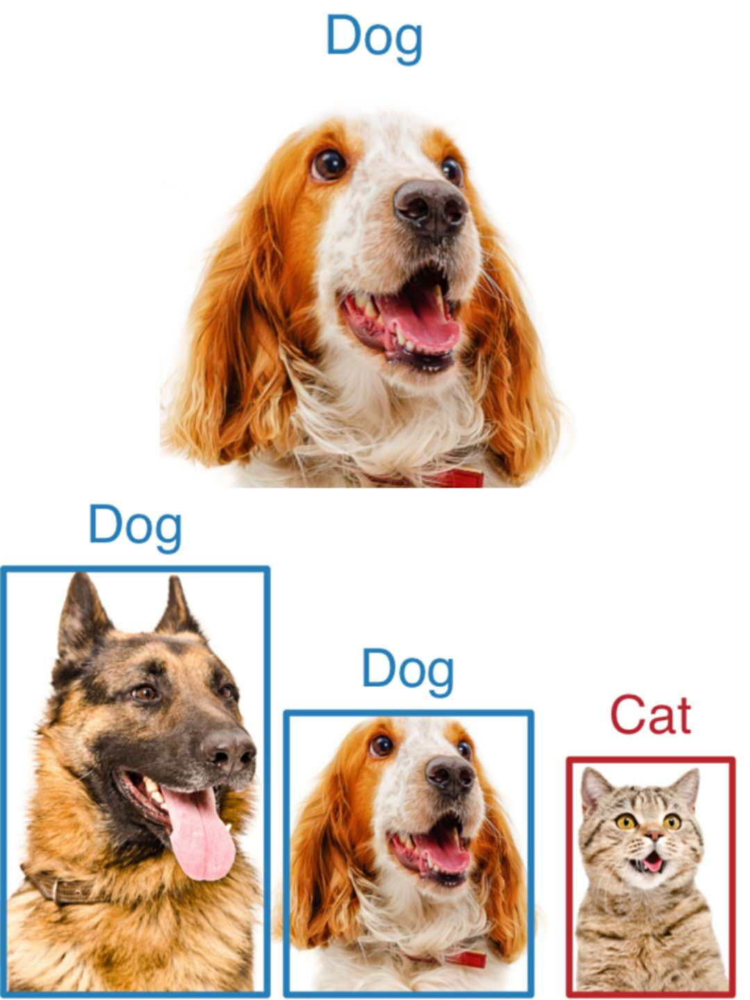
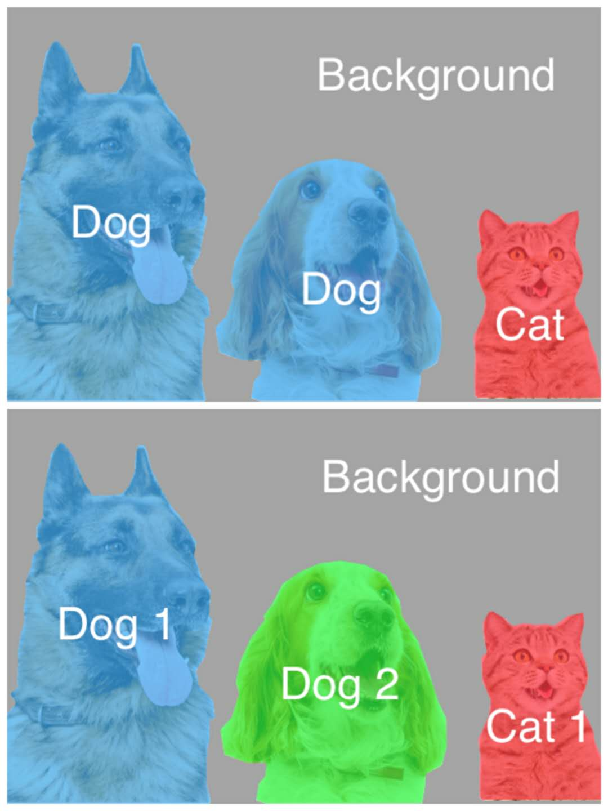
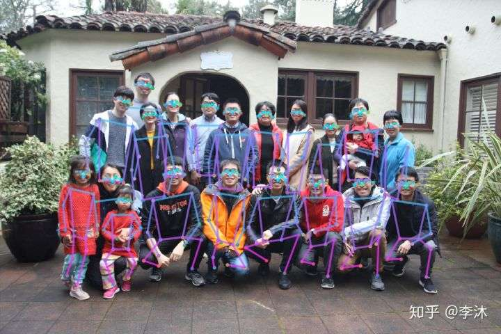
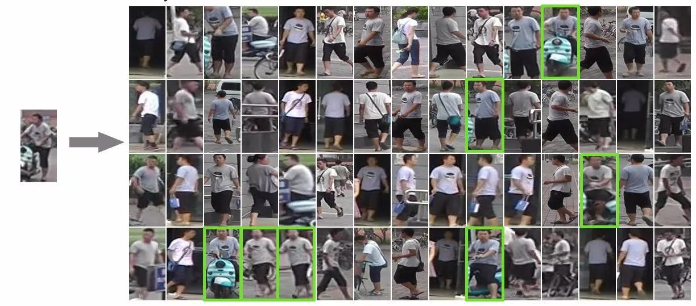

# 适合传统软件工程师的 Machine Learning 学习路径

从造丹炉到学炼丹的修真之路

目录
=================

   * [适合传统软件工程师的 Machine Learning 学习路径](#适合传统软件工程师的-machine-learning-学习路径)
      * [背景](#背景)
         * [深度学习在计算机视觉领域的应用](#深度学习在计算机视觉领域的应用)
      * [学习路径](#学习路径)
         * [第一阶段 炼气期（3-5 周，每周 2-4 小时）](#第一阶段-炼气期3-5-周每周-2-4-小时)
            * [目标](#目标)
            * [推荐资料](#推荐资料)
            * [Checklist](#checklist)
         * [第二阶段 筑基期（2 周，每周 3-5 小时）](#第二阶段-筑基期2-周每周-3-5-小时)
            * [目标](#目标-1)
            * [推荐资料](#推荐资料-1)
            * [Checklist](#checklist-1)
         * [第三阶段 金丹期（2 周，每周 3-5 小时）](#第三阶段-金丹期2-周每周-3-5-小时)
            * [目标](#目标-2)
            * [推荐资料](#推荐资料-2)
            * [Checklist](#checklist-2)
         * [第四阶段 元婴期（2 周，每周 3-5 小时）](#第四阶段-元婴期2-周每周-3-5-小时)
            * [目标](#目标-3)
            * [推荐资料](#推荐资料-3)
            * [Checklist](#checklist-3)
         * [第五阶段 化神期（3-5 周，每周 3-5 小时）](#第五阶段-化神期3-5-周每周-3-5-小时)
            * [目标](#目标-4)
            * [推荐资料](#推荐资料-4)
            * [Checklist](#checklist-4)
         * [第六阶段 练虚期 （1 周，3-5 小时）](#第六阶段-练虚期-1-周3-5-小时)
            * [目标](#目标-5)
            * [推荐资料](#推荐资料-5)
            * [Checklist](#checklist-5)
         * [第七阶段 大乘期（终身学习）](#第七阶段-大乘期终身学习)
            * [目标](#目标-6)
            * [推荐资料](#推荐资料-6)
      * [参考文献与资料](#参考文献与资料)
      * [许可协议](#许可协议)

Created by [gh-md-toc](https://github.com/ekalinin/github-markdown-toc)

## 背景

[才云科技][] 是一家基于容器技术和人工智能，打造新一代智能云计算平台和 AI 服务的公司。而随着超参数搜索，模型结构搜索，模型量化与压缩等功能与概念在业界的逐渐落地，机器学习平台的开发工作对机器学习本身的要求越来越高。这要求传统的软件开发工程师不仅需要了解分布式系统等与云计算相关的知识，也需要了解基础的机器学习原理与概念。因此，出于帮助才云内部的[机器学习平台开发工程师们](https://www.lagou.com/jobs/5217772.html?source=pl&i=pl-4)更加好地了解机器学习的目的，我们于 2019 年内部推出了这一文档，现以开源的方式进行维护。

文档主要为传统的软件工程师提供一个**循序渐进，实践性强**的路径，来了解深度学习的基本原理，以及深度学习在计算机视觉和其他领域的应用。由于我们的目标不是让每一位软件工程师转型为算法工程师，而是学习深度学习的知识来指导我们的工作。因此**内容更偏向工程化，而非深度学习的数学知识与理论证明**。

这一文档以计算机视觉领域中的图像识别问题作为切入口，聚焦于一个具体的问题，深入浅出地了解经典的深度网络模型，而不会对各个领域浅尝则止。

### 深度学习在计算机视觉领域的应用

深度学习在计算机视觉领域有许多应用场景。

Fig. 1 图像识别与对象识别

首先最简单的是图像识别，也就是 Fig. 1 中的上图。图片中只有一个物体，而图像识别算法会识别出图像中唯一的物体是什么物体。这一例子中是狗。图像识别也是我们这一课程面向的应用场景。其代表模型有 MNIST（数字图像识别），ResNet, MobileNet, DenseNet, VGG 等。

接下来，是对象检测，或者说目标检测，也就是 Fig. 1 中的下图。在一张图中，检测出图中所有的对象以及类别（两条狗，一只猫），以及它们的位置（蓝色框和红色框）。这一应用场景下的经典模型有Faster RCNN, SSD, Yolo-v3 等。

Fig. 2 语义分割与实例分割

再接下来，有图像语义分割，也就是 Fig. 2 中的上图。图像语义分割就是机器自动从图像中分割出对象区域，并识别其中的内容。图中例子为识别了狗和猫，并且用不同的颜色区分区域。这一应用场景的经典模型有 FCN, PSP, DeepLab v3 等。

图像实例分割如 Fig. 2 下图所示，是在语义分割的基础上，划分不同实例。狗作为一个对象（可以理解为面向对象中的类），有不同的实例。实例分割不仅需要区分不同对象，还需要区分不同实例。这一场景的经典模型有 Mask RCNN 等。

Fig. 3 姿态估计（credit：知乎李沐）

姿态估计，如图 Fig. 3 所示，就是根据图像确定人体骨架，以及人体姿态动作。这一领域的经典模型有 Simple Pose 等。

Fig. 4 GAN

除了上述应用，还有一类特殊的模型应用，即生成式对抗网络。它可以被用来做风格转移（照片转水墨画风格等），超分辨率（分辨率低的图片生成高分辨率的图片，或者根据低分辨率的图片复原高分辨率的图片等）等不同的生成图片任务上。Fig. 4 中所展示的就是一个 GAN 模型利用人脸图片生成对应 emoji 下的图片的过程。这一模型由于应用很广而且过于灵活，因此有很多不同的实现，比较经典的有 WGAN, CycleGAN，SRGAN 等。

除此之外，如 Fig. 5 所示，还有一类应用就是行人重识别。这是利用计算机视觉技术判断图像或者视频序列中是否存在特定行人的技术。广泛被认为是一个图像检索的子问题。给定一个监控行人图像，检索跨设备下的该行人图像。旨在弥补目前固定的摄像头的视觉局限，并可与行人检测/行人跟踪技术相结合，可广泛应用于智能视频监控、智能安保等领域。

深度学习在计算机视觉领域的应用形形色色，我们只针对其中最简单的应用，也就是图像识别问题展开学习。

## 学习路径

学习路径一共分为六个阶段，其中第一个阶段主要会了解 DL 的基本概念；第二个阶段会以 kNN（k 近邻算法）为例，了解传统机器学习在图像分类问题的解法。第三个阶段会了解梯度下降，反向传播等神经网络的基础知识。第四个阶段会了解卷积神经网络的卷积层，池化层等概念。第五个阶段将会更加深入地了解模型训练的过程。第六个阶段会以 TensorFlow 为例，了解模型部署和可视化过程，最后一个阶段则是自由的探索与学习。

其中会首先介绍每一阶段的目标，随后是推荐的学习资料，最后是 Checklist。

### 第一阶段 炼气期（3-5 周，每周 2-4 小时）

#### 目标

这一阶段的主要目标是，熟悉 AI，尤其是 DL 的基本概念。在这一阶段中，以下知识会需要了解：

- 什么是数据
- 神经网络是什么，以及它在最近兴起的原因
- 机器学习的基本概念，监督学习与非监督学习的关系
- 神经网络与机器学习的关系
- 深度网络是什么，它与神经网络又是什么关系

通过这一阶段的了解，我们会清楚，机器学习是一门怎样的学科，神经网络在其中又扮演着怎样的角色。

#### 推荐资料

首先，对于英语水平不错的同学，推荐先上完 [AI For Everyone](https://www.coursera.org/learn/ai-for-everyone)。这一课程是由 Andrew Ng 推出的面向 CEO、CTO、产品经理、工程师等不同角色的科普性课程。目前这一课程暂无中文翻译，但有英文字幕。课程分为四周，每周大约需要 2-3 个小时即可。因此总共只需要 8-12 小时即可看完。这门课程可以帮助塑造对 AI 的感性认识。

如果英语确实是障碍，可以跳过这一课程的学习。

接下来，可以进行下一步的学习。[网易深度学习工程师微专业][]中的[第一课-神经网络和深度学习][]中的第一周的所有课程是下一步学习的目标。这一微专业同样是 Andrew Ng 推出的课程系列。在第一门课程的第一周中，主要介绍了神经网络是什么，和深度网络的关系等。

#### Checklist

- [ ] （可选） AI For Everyone 所有课程
- [ ] 网易深度学习工程师微专业中的第一课-神经网络和深度学习中的第一周的所有课程

### 第二阶段 筑基期（2 周，每周 3-5 小时）

#### 目标

在上一阶段，我们已经了解了 DL 是什么，可以用来做什么。第二阶段中，我们将面向图像识别这一特定的场景，了解一些机器学习传统的算法和一些基础的数学概念。

图像识别场景是深度学习领域应用最广泛，也是最经典的应用场景。从这一场景入手有助于简化问题。图像识别，顾名思义，就是给定一个图片，预测这一图片上的内容是什么（如，猫，狗，人，树木等）。

在这一阶段中，我们需要了解：

- 图像识别是一个什么问题
- 传统统计学，和传统机器学习的方法是如何解决这一问题的（主要关注 kNN 算法即可）

#### 推荐资料

推荐 [2017 斯坦福李飞飞视觉识别课程][]，这一课程具有良好的中文翻译。在第二阶段，我们只需要上完第一讲和第二讲，也就是课时 1 到课时 6 即可。总计大约 2 小时。其中第二讲，可以只关注 kNN 这一最简单的算法。

除了视频以外，[斯坦福这一课程的主页](cs231n.stanford.edu/syllabus.html)也有一些资源，这些都是非常有帮助的：

- [NumPy 的教程](http://cs231n.github.io/python-numpy-tutorial/)（[中文版](https://zhuanlan.zhihu.com/p/20878530?refer=intelligentunit)）推荐学习，了解 NumPy 基本用法，有助于完成渡劫任务
- [图像分类笔记](http://cs231n.github.io/classification/)（[中文版上](https://zhuanlan.zhihu.com/p/20894041?refer=intelligentunit)，[中文版下](https://zhuanlan.zhihu.com/p/20900216?refer=intelligentunit)）强烈推荐，是课程的总结笔记，有助于了解课程。可以只看到 kNN 之前的内容

这一阶段有一个渡劫任务：[CS231n-Assignment-1][] 的 Q1: k-Nearest Neighbor classifier (20 points)。这一问题是利用 KNN 这一简单的算法，来进行图像识别任务。如果有问题，可以参考[网友的开源解答][]。

如果对 kNN 算法仍有疑问，可以参考文章：

- [机器学习（一）——K-近邻（KNN）算法](https://www.cnblogs.com/ybjourney/p/4702562.html)
- [K 近邻算法](http://cynhard.com/2018/06/10/ML-kNN/)
- [K Nearest Neighbor 算法](https://coolshell.cn/articles/8052.html)

这一算法能够在图像分类（CIFAR-10 数据集）问题上取得约 28% 的准确率。CIFAR-10 数据集一共包含 60000 张图片，一共有十类物体（飞机（ airplane ）、汽车（ automobile ）、鸟类（ bird ）、猫（ cat ）、鹿（ deer ）、狗（ dog ）、蛙类（ frog ）、马（ horse ）、船（ ship ）和卡车（ truck ））。28% 的准确率意味着 kNN 算法在给定 100 张图片的情况下，可以识别大约 28 张图片为正确的分类。而随机算法的准确率为 10% 左右。

如果学完后仍不满足，可以继续[网易深度学习工程师微专业][]中的[第一课-神经网络和深度学习][]中的第二周所有课程。这一周的课程会介绍与上面提到的李飞飞课程相似的内容，以及一些额外的数学工具，但是不特别针对视觉识别场景。如果觉得其中的数学要求过多，可以跳过不看。

#### Checklist

- [ ] 2017 斯坦福李飞飞视觉识别课程 第一讲，第二讲
- [ ] CS231n-Assignment-1 的 Q1
- [ ] （可选） 网易深度学习工程师微专业中的第一课-神经网络和深度学习中的第二周所有课程

### 第三阶段 金丹期（2 周，每周 3-5 小时）

#### 目标

在上一个阶段，我们大致了解了传统机器学习算法（KNN）是如何解决图像识别问题的。接下来我们需要了解：

- 损失函数是什么，它的作用是什么
- 梯度下降等优化方法是什么，它们想解决什么问题
- 神经网络的反向传播是在做什么

正所谓结为金丹客，方是我辈人。通过这一阶段的学习，我们会掌握神经网络中的基本概念，真正走入深度学习的殿堂。

#### 推荐资料

仍然推荐 [2017 斯坦福李飞飞视觉识别课程][]，这里需要上完第三讲和第四讲。这里的内容可能有一些数学知识。损失函数涉及初等数学，梯度下降涉及偏导数，反向传播涉及求导的链式法则。如果能多了解一些数学知识最好，如果不了解可以先知道下这些数学知识都是为了做什么而存在的。

这里还有一些参考资料：

- [线性分类笔记](http://cs231n.github.io/linear-classify/)（[中文版上](https://zhuanlan.zhihu.com/p/20918580?refer=intelligentunit)，[中文版中](https://zhuanlan.zhihu.com/p/20945670?refer=intelligentunit)，[中文版下](https://zhuanlan.zhihu.com/p/21102293?refer=intelligentunit)）推荐，学习线性分类这一最简单的分类器有助于理解分类任务
- [最优化理论笔记](http://cs231n.github.io/optimization-1/)（[中文版上](https://zhuanlan.zhihu.com/p/21360434?refer=intelligentunit)，[中文版下](https://zhuanlan.zhihu.com/p/21387326?refer=intelligentunit)）有部分数学知识，讨论的是优化损失函数的数学工具，可以选择性阅读，建议阅读其中梯度下降部分。
- [反向传播笔记](http://cs231n.github.io/optimization-2/)（[中文版](https://zhuanlan.zhihu.com/p/21407711?refer=intelligentunit)）有比较多数学方面（主要是高等数学与微积分）的知识，但反向传播是神经网络之所以有效的基石，建议选择性阅读。

梯度下降其实是一个非常直观的算法，所有的机器学习算法，都可以理解为运用某种算法来最小化损失函数的一个过程，而梯度下降则是“某种算法”中比较常用的一种。如果视频课程中介绍的仍然有些晦涩，可以参考：

- [如何直观形象的理解方向导数与梯度以及它们之间的关系？](https://www.zhihu.com/question/36301367)

如果还是有些困难，不妨先把它当做一个黑盒，继续往下去看。这一黑盒过程的输入是模型的参数，和模型对应的损失函数。黑盒的过程是寻找合适的模型参数，使得模型对应的损失最小的过程。

这一阶段也有两个渡劫任务：[CS231n-Assignment-1][] 的 Q2 和 Q3。这两个问题是利用传统的机器学习方法解决视觉识别任务。如果有问题，可以参考[网友的开源解答][]。如果觉得数学知识太多，可跳过。

如果学完后仍不满足，可以继续[网易深度学习工程师微专业][]中的[第一课-神经网络和深度学习][]中的第三周和第四周所有课程。在这一课程中，会介绍激活函数、梯度下降、反向传播等概念。如果觉得其中的数学要求过多，可以跳过不看。

#### Checklist

- [ ] 2017 斯坦福李飞飞视觉识别课程 第三讲，第四讲
- [ ] CS231n-Assignment-1 的 Q2 Q3
- [ ] （可选） 网易深度学习工程师微专业中的第一课-神经网络和深度学习中的第三周和第四周所有课程

### 第四阶段 元婴期（2 周，每周 3-5 小时）

#### 目标

这一阶段的目标，是在上周对神经网络的基础上，了解卷积神经网络。

卷积神经网络是一种由一个或多个**卷积层**和顶端的**全连通层**（对应经典的神经网络）组成，同时也包括关联权重和**池化层**。这一结构使得卷积神经网络能够利用输入数据的二维结构。与其他深度学习结构相比，卷积神经网络在图像和语音识别方面能够给出更好的结果。

本阶段需要了解如下概念：

- 卷积是什么，卷积的步长是什么，卷积为什么有效，为什么要在视觉识别场景下使用卷积操作
- 池化操作是什么，它的作用是什么

经过这一阶段的学习，我们就已经掌握了视觉识别场景下最常用的神经网络结构：卷积神经网络。

#### 推荐资料

仍然推荐 [2017 斯坦福李飞飞视觉识别课程][]，这里需要上完第五讲。这里涉及的数学知识非常少，只有矩阵运算和部分高等数学的知识。

这里有一个参考笔记：

- [卷积神经网络笔记](http://cs231n.github.io/convolutional-networks/)（[中文版](https://zhuanlan.zhihu.com/p/22038289?refer=intelligentunit)）强烈建议阅读，是对课程的总结。

这一阶段的渡劫任务为 [CS231n-Assignment-1][] 的 Q5。如果有问题，可以参考[网友的开源解答][]。如果觉得数学知识太多，可跳过。

如果学完后仍不满足，可以继续[网易深度学习工程师微专业][]中的[第四课-卷积神经网络][]的第一周内容。这一课程与上面的李飞飞课程第五讲内容相似，可以帮助理解。如果觉得其中的数学要求过多，可以跳过不看。

#### Checklist

- [ ] 2017 斯坦福李飞飞视觉识别课程 第五讲
- [ ] CS231n-Assignment-1 的 Q5
- [ ]（可选） 网易深度学习工程师微专业中的第四课卷积神经网络的第一周内容

### 第五阶段 化神期（3-5 周，每周 3-5 小时）

#### 目标

在上一阶段的学习中，我们已经了解了卷积神经网络，这一阶段主要学习如何训练卷积神经网络。

这一阶段主要需要了解：

- 激活函数的选择
- 模型训练的本质是什么（前向与后向传播）
- 如何利用 PyTorch，TensorFlow 等框架进行模型的训练

通过这一阶段的学习，我们可以自豪地说，我们成为了一个合格的炼丹师，懂得丹药之理（模型训练的本质），也懂得如何利用炼丹炉（TensorFlow）炼制丹药（训练模型）。

#### 推荐资料

这一阶段，仍然推荐 [2017 斯坦福李飞飞视觉识别课程][]，这里需要上完第六讲和第七讲。在这两个讲座中，我们将学习正则化、激活函数等内容。

这里有一些推荐的笔记：

- [神经网络笔记(1)](http://cs231n.github.io/neural-networks-1/)（[中文版上](https://zhuanlan.zhihu.com/p/21462488?refer=intelligentunit)，[中文版下](https://zhuanlan.zhihu.com/p/21513367?refer=intelligentunit)）推荐，可以带领我们重新审视什么是神经网络
- [神经网络笔记(2)](http://cs231n.github.io/neural-networks-2/)（[中文版](https://zhuanlan.zhihu.com/p/21560667?refer=intelligentunit)）推荐，是课程的补充，以笔记的形式介绍了批量归一化，正则化等需要了解的内容。但如果数学知识过多，可略过。
- [神经网络笔记(3)](http://cs231n.github.io/neural-networks-3/)（[中文版上](https://zhuanlan.zhihu.com/p/21741716?refer=intelligentunit)，[中文版下](https://zhuanlan.zhihu.com/p/21798784?refer=intelligentunit)）中文版上建议阅读，中文版下可选择性阅读

如果学完后仍不满足，可以继续[网易深度学习工程师微专业][]中的[第二课-改善深层神经网络][]的全部三周课程，与李飞飞课程类似但编排不同，一起学习可相互促进。

这一阶段有一个渡劫任务：[CS231n-Assignment-2][] 的 Q1 Q4 Q5，如果自觉了解非常透彻，可继续完成 Q2 Q3。如果有问题，可以参考网友的开源解答。如果觉得数学知识太多，可跳过。但建议起码完成 Q5，或阅读[网友的开源解答][]。

#### Checklist

- [ ] 2017 斯坦福李飞飞视觉识别课程 第六讲，第七讲
- [ ] CS231n-Assignment-2 的 Q1 Q4 Q5
- [ ] （可选） 网易深度学习工程师微专业中的第二课改善深层神经网络的全部三周课程

### 第六阶段 练虚期 （1 周，3-5 小时）

#### 目标

在之前的阶段中，我们已经学习了如何训练一个模型，接下来我们需要了解：

- 模型可视化的工具与作用
- 如何进行模型部署

对于有计算机系统背景的炼丹师来说，这反而是返璞归真，最简单的阶段。这两个需求在 TensorFlow 框架上对应两个工具 TensorBoard 和 TFServing。这也是 TensorFlow 之所以比 PyTorch 更受工业界欢迎的重要原因。

#### 推荐资料

对于模型可视化，建议阅读 [TensorBoard 文档](https://www.tensorflow.org/guide/summaries_and_tensorboard?hl=zh-cn)，以及观看[视频](https://www.youtube.com/watch?v=eBbEDRsCmv4)（有中文字幕）。建议以 TF [MNIST](https://www.github.com/tensorflow/tensorflow/blob/r1.10/tensorflow/examples/tutorials/mnist/mnist_with_summaries.py) 为示例，自己进行一次可视化训练。

对于模型部署，建议阅读 [TensorFlow 学习笔记-模型部署章节](https://bookdown.org/leovan/TensorFlow-Learning-Notes/4-5-deploy-tensorflow-serving.html)（为第三方文档，不是 TensorFlow 官方文档）。建议以 MNIST 或者 ResNet 为例，在 Clever 平台上利用模型推理服务部署一个模型或者在自己本地利用 TFServing 部署一个模型，并且尝试利用 HTTP 请求进行访问。

#### Checklist

- [ ] TensorBoard 文档，以及观看视频
- [ ] 阅读 TensorFlow 学习笔记-模型部署章节

### 第七阶段 大乘期（终身学习）

#### 目标

完成了上述阶段的学习后，我们已经了解了卷积神经网络从原理，到训练，再到部署的知识。接下来可以：

- 继续学习卷积神经网络，了解各种经典的模型（AlexNet，ResNet 等）
- 学习循环神经网络（RNN），一种不同于卷积神经网络（CNN）的全新网络。可以用来做时序预测等不同于图像是别的任务
- 学习生成网络（GAN）
- 其他一切你想做的

#### 推荐资料

推荐继续完成 [2017 斯坦福李飞飞视觉识别课程][]的所有讲座。其中会介绍 RNN，GAN，强化学习等不同的神经网络，也会介绍经典的 CNN 模型。之后可以考虑在 Kaggle 上寻找自己感兴趣的算法比赛，在真实的比赛中感受神经网络的能力。Kaggle 是一个算法爱好者们利用数据组织机器学习算法比赛的平台，上面有不同难度的问题。

## 参考文献与资料

1. [GluonCV: a Deep Learning Toolkit for Computer Vision][GluonCV]
1. [TensorFlow 学习笔记](https://bookdown.org/leovan/TensorFlow-Learning-Notes/)
1. [知乎问答：普通程序员如何正确学习人工智能方向的知识？](https://www.zhihu.com/question/51039416)

## 许可协议

- 本文遵守[创作共享CC BY-NC-SA 3.0协议](https://creativecommons.org/licenses/by-nc-sa/3.0/cn/)
- 商业目的转载，请联系 <marketing@caicloud.io>
- 如有任何版权问题，请联系 <gaoce@caicloud.io>

[才云科技]: https://caicloud.io/
[GluonCV]: https://gluon-cv.mxnet.io/
[网易深度学习工程师微专业]: https://mooc.study.163.com/smartSpec/detail/1001319001.htm
[2017 斯坦福李飞飞视觉识别课程]: https://study.163.com/course/introduction.htm?courseId=1004697005&_trace_c_p_k2_=186f7182b63648daa0d42d0058413cc0
[第一课-神经网络和深度学习]: https://mooc.study.163.com/course/2001281002#/info
[CS231n-Assignment-1]: http://cs231n.github.io/assignments2019/assignment1/
[网友的开源解答]: https://github.com/MahanFathi/CS231
[第四课-卷积神经网络]: https://mooc.study.163.com/course/2001281004#/info
[第二课-改善深层神经网络]: https://mooc.study.163.com/course/2001281003#/info
[CS231n-Assignment-2]: http://cs231n.github.io/assignments2019/assignment2/
